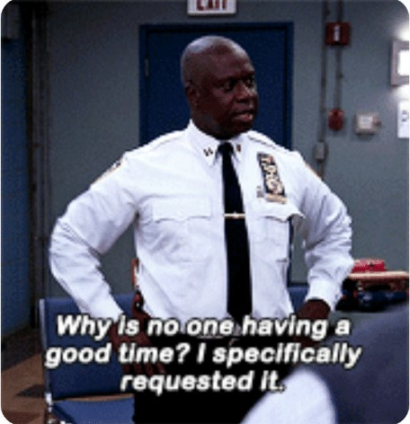

# **Hello**

    ```
    $$$$$$\                           $$\   $$\          $$\     
    $$  __$$\                          $$ |  $$ |         $$ |    
    $$ /  \__|$$$$$$\ $$$$$$\ $$\   $$\$$ |  $$ |$$$$$$\$$$$$$\   
    $$ |$$$$\$$  __$$\\____$$\$$ |  $$ $$$$$$$$ |\____$$\_$$  _|  
    $$ |\_$$ $$ |  \__$$$$$$$ $$ |  $$ $$  __$$ |$$$$$$$ |$$ |    
    $$ |  $$ $$ |    $$  __$$ $$ |  $$ $$ |  $$ $$  __$$ |$$ |$$\ 
    \$$$$$$  $$ |    \$$$$$$$ \$$$$$$$ $$ |  $$ \$$$$$$$ |\$$$$  |
    \______/\__|     \_______|\____$$ \__|  \__|\_______| \____/ 
                            $$\   $$ |                          
                            \$$$$$$  |                          
                            \______/                           
    (Dumbass)
    ```

### Guidelines
    Feel free to play around with all public repositories.
    Any pull requests to fix my mess will be appreciated ╰(*°▽°*)╯
    Mention my github url to credit me incase you're using a repository
    Have FUN !!

    